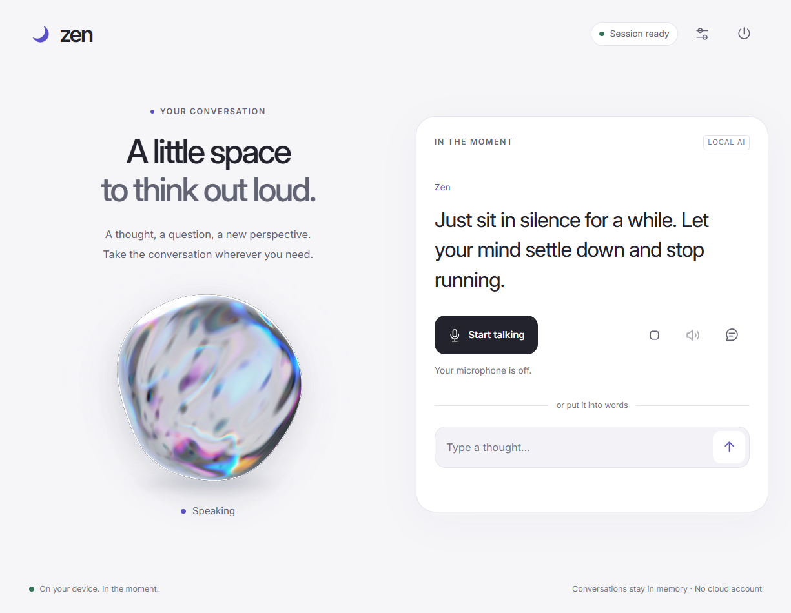
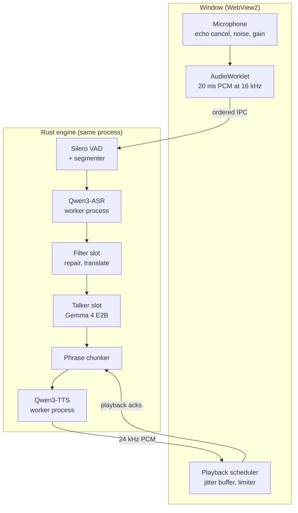
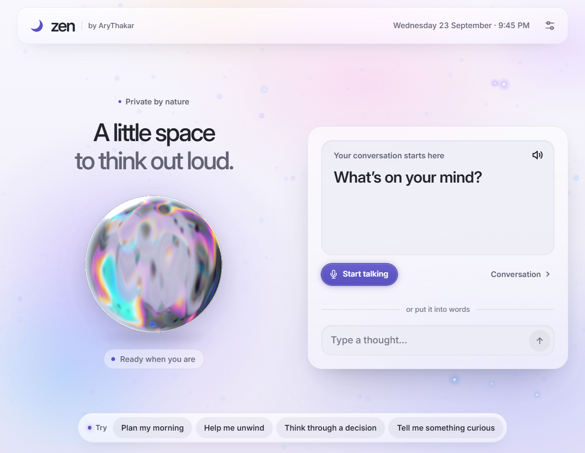
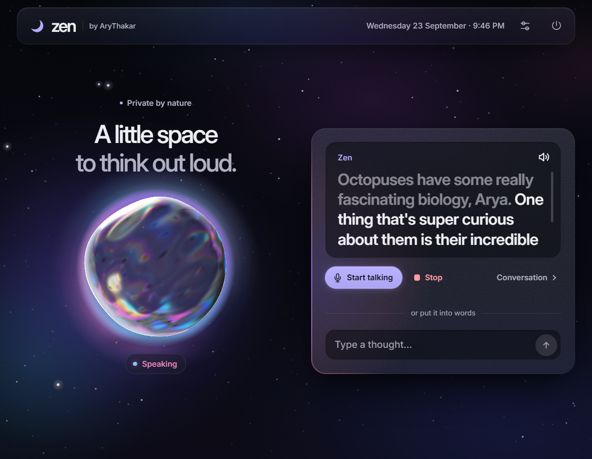
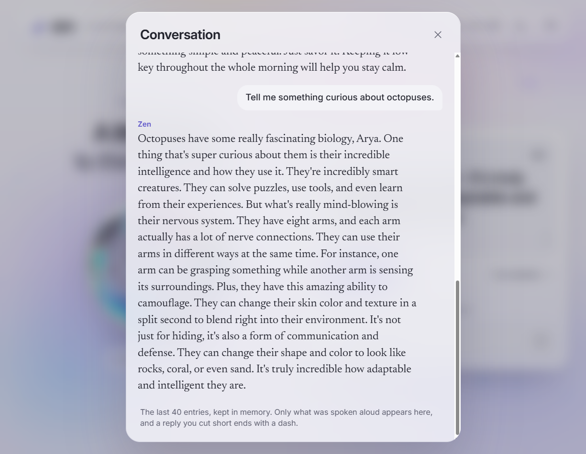
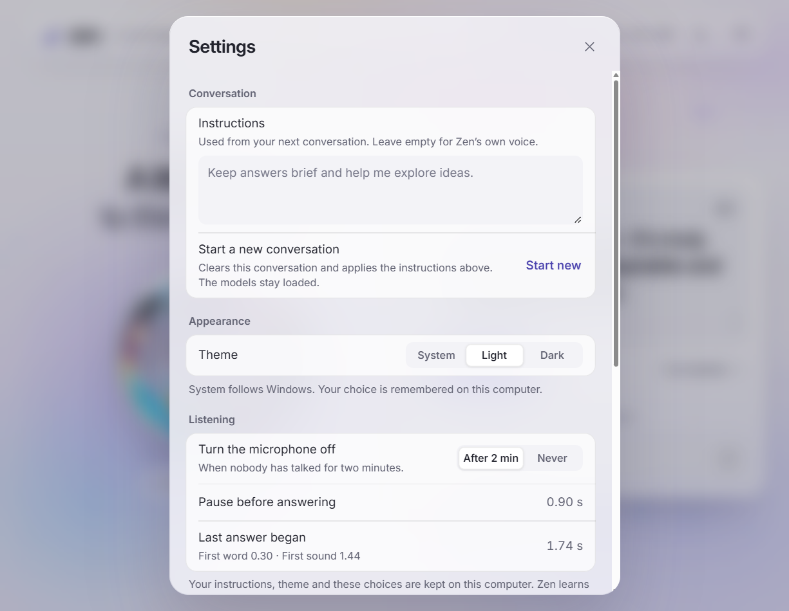

<div align="center">


# Zen

**A private voice assistant that runs entirely on your own PC.**

Speech recognition, a language model and streaming speech synthesis, all local, behind one
desktop window. Nothing you say, hear or type leaves the machine or is written to disk.

[](https://github.com/AryThakar/zen/actions/workflows/ci.yml)




<sub>Screenshots are of the running app. Every reply shown was generated and spoken live by the local models.</sub>

</div>

## What it is

Zen is a desktop voice assistant you talk to like a person. Press **Start talking** and speak:
Zen listens, works out when you have finished, answers out loud, and stops the moment you cut
in. You can type instead whenever you like.

Everything runs on your own GPU and CPU:

| Stage | Model | Runtime | Runs on |
| --- | --- | --- | --- |
| Voice activity | Silero VAD | ONNX Runtime, compiled into the app | CPU |
| Speech to text | Qwen3-ASR 1.7B (Q4_K) | CrispASR, isolated worker process | CPU |
| Transcript repair and reply | Gemma 4 E2B (QAT, UD-Q4_K_XL) with an MTP drafter | llama.cpp `llama-server`, supervised | GPU |
| Text to speech | Qwen3-TTS 12Hz 0.6B Base (Q8_0, or Q4_K_M), cloned from a reference clip | qwentts.cpp, isolated worker process | GPU |

The application is Rust on [Tauri 2](https://tauri.app/). The interface is hand-written HTML,
CSS and JavaScript in WebView2, with no framework or bundler, and is compiled into the
executable.

## Highlights

- **Private by construction.** No cloud APIs, account or telemetry. The model server is bound
  to loopback (enforced in code), the speech workers use authenticated loopback sockets, and
  audio, transcripts and prompts are never written to disk.
- **Natural turn-taking.** Talk over Zen and he stops: confirmed speech, not just a loud noise,
  ends the reply, and history keeps only the words you actually heard, so the model never
  believes it told you something you missed. Speaking while he is still working out what you
  said is treated as the rest of the same question rather than an interruption, so a long
  question is never cut in half by its own second sentence.
- **An end-of-turn pause that learns you.** A fixed silence threshold always cuts somebody off.
  Zen notices when you carry on straight after being cut off, waits longer next time, and
  relaxes again over clean turns, within 0.6–2.0 s.
- **Transcript repair before answering.** A dedicated model slot fixes misrecognised words and
  translates non-English speech into English. A guard rejects "corrections" that invent words
  you never said, and a repair that runs out of budget falls back to the raw transcript.
- **Streaming speech.** Replies start playing about 0.6 s after synthesis begins. A jitter
  buffer, equal-power seam crossfades and an envelope-following limiter keep playback clean.
  An ordinary reply is synthesised in one piece rather than split, because every split is a
  separate call to the synthesiser that restarts the contour and resets the emphasis; the
  window before Zen speaks is a little longer for it.
- **Fits a 4 GB laptop GPU.** One `llama-server` with two fixed slots, a stateless filter and a
  stateful talker with a cached prompt prefix, plus Multi-Token Prediction drafting and a q4_0
  KV cache. The whole stack, speech synthesis included, runs in about 3.6 GB of VRAM.
- **Hard to wedge.** ASR and TTS run in separate processes so their GGML builds cannot collide,
  and a crash there fails one turn rather than the app. A Windows job object kills every child
  process if Zen dies, so a crash never leaves the GPU memory and port held.
- **A calm interface.** Light and night themes, reduced-motion support, live captions, and a
  WebGL glass orb that deforms with the reply audio and swells with your voice.

## Performance

Measured on 13 September 2026 with the release build, on an NVIDIA RTX 3050 Laptop GPU (4 GB),
Intel Core i5-12450H and 16 GB RAM, Windows 11.

| Measurement | Result | Source |
| --- | --- | --- |
| LLM decode speed, talker slot with MTP | 81–97 tokens/s over three 100+ token replies | llama-server `timings`, production flags |
| LLM prompt processing, ~20-token prompt | 25–53 ms | same |
| VRAM, LLM alone (two 8k slots + drafter) | 1.6 GB | `nvidia-smi` |
| VRAM, live session (LLM + TTS) | 3.6 GB of 4 GB | `nvidia-smi` |
| TTS time to first audio | 605 ms | `zen.exe --self-test` |
| TTS speed | 2.96 s of speech in 1.46 s | `zen.exe --self-test` |
| TTS cancellation | acknowledged in 5 ms | `zen.exe --self-test` |
| ASR, 2.9 s utterance | 1.64 s | `zen.exe --self-test` |
| Typed message to Zen speaking, warm session | ~1.5 s (1482 ms, 1575 ms) | scripted session in the real window |

The first turn after launch also loads the models, which took about 14 s on this machine.

## How it works



The webview owns the microphone and speaker, so capture gets Chromium's echo cancellation,
noise suppression and gain control; the Rust side receives finished 16 kHz audio and owns
everything else. A turn moves through `idle → listening → transcribing → thinking → preparing
→ speaking`, and every asynchronous job carries the generation it was issued under, so work
that finishes after an interruption is dropped instead of played.

The page acknowledges each block of audio only once it has actually played. Those
acknowledgements drive backpressure and decide what enters the conversation history.

- [docs/ARCHITECTURE.md](docs/ARCHITECTURE.md): the full design and the reasoning behind it
- [docs/BUILDING_NATIVE.md](docs/BUILDING_NATIVE.md): building the native libraries yourself,
  for another GPU vendor or platform
- [PROTOCOL.md](PROTOCOL.md): the IPC contract between the interface and the engine

## Screenshots

| Ready to talk | Night theme, speaking |
| --- | --- |
|  |  |
| **Conversation history** | **Settings** |
|  |  |

## Requirements

- **Windows 11** (WebView2 is part of the OS). Windows is the only supported platform today.
- **NVIDIA GPU with 4 GB of VRAM** and a driver that supports CUDA 13, the version of the
  bundled CUDA runtime DLLs
- **16 GB RAM** and about **5.9 GB of disk** for the models and native libraries
- To build: **Rust 1.91+** (MSVC toolchain). **Node.js 22+** only for the interface tests.

## Getting started

### 1. Build

```powershell
git clone https://github.com/AryThakar/zen.git
cd zen
cargo build --release --locked
```

### 2. Install the models and native libraries

The weights and native runtimes (about 5.9 GB) are not part of this repository. Zen looks for
them in an **installation root**:

```text
<root>\
├── Zen.exe                  the built target\release\zen.exe, renamed
├── bin\                     llama.cpp CUDA build and CUDA runtime DLLs
├── lib\                     qwen.dll (qwentts.cpp) and its ggml DLLs
└── model\
    ├── E2B\                 Gemma 4 E2B GGUF and MTP drafter
    ├── Qwen ASR\            Qwen3-ASR GGUF, crispasr.dll and CPU ggml DLLs
    └── Qwen TTS\            Qwen3-TTS talker and tokenizer GGUFs, your voice reference
```

[docs/SETUP.md](docs/SETUP.md) lists every file, where to get it, and the checksums of the
exact files Zen was tested with. Two of the three native runtimes have official Windows builds;
the third is attached to Zen's [releases](https://github.com/AryThakar/zen/releases) because
upstream publishes none. To build any of them yourself — for AMD, Intel, or a platform other
than Windows — see [docs/BUILDING_NATIVE.md](docs/BUILDING_NATIVE.md).

### 3. Run

Copy `target\release\zen.exe` into the root as `Zen.exe` and double-click it. There is no
installer, service or first-run setup. Zen finds the root beside the executable or in any
parent directory, so a clone inside the root also runs in place. Otherwise pass `--root PATH`
or set `ZEN_ROOT`.

Check the installation from a terminal first:

```powershell
.\Zen.exe --self-test
```

This loads the real models without opening a window, then checks synthesis, recognition,
conversation memory, both prompts and cancellation. A healthy install ends with
`Self-test passed`. If a model or library is missing, Zen names the missing file.

## Using Zen

- **Talk.** Press **Start talking**, allow the microphone, and speak normally. Pause when you
  are done; Zen answers out loud. Speak over it to interrupt.
- **Type.** Write in the box under the controls. Typing interrupts whatever Zen is doing.
- **Stop, sound cues, history.** The stop button ends the current reply, the speaker toggles
  the soft interface sounds, and the speech bubble opens the conversation so far.
- **Settings.** Per-conversation instructions, light or night theme, the listening pause
  (automatic, or set it yourself), and microphone and speaker selection.
- **Closing the window keeps Zen running** in the tray with the models loaded. Quit from the
  tray icon. Launching Zen again brings the existing window forward instead of starting a
  second engine.
- **End session** (the power button) releases the models and all conversation state.

The system prompt is two compiled-in files, joined in that order:

- [`src/prompts/core.txt`](src/prompts/core.txt) — the voice rules. What makes a reply
  speakable rather than readable: no lists or markdown, numbers as words, and that a request
  outranks brevity, so Zen never cuts an answer short for being long to say.
- [`src/prompts/talker.txt`](src/prompts/talker.txt) — the persona, and **the only part
  replaced** by `--system-prompt` or **Conversation instructions** in Settings. Custom
  instructions cannot drop the voice rules, because every path that sets them goes through the
  same composition.

The shipped persona speaks as a warm, direct woman, always replies in English, and says plainly
that it cannot set timers, browse or control devices rather than pretending to. It addresses
its user by name (the author's), and [`src/prompts/filter.txt`](src/prompts/filter.txt)
expects that name when repairing transcripts. Change the name in both files for your own build.

A session opens with a spoken greeting chosen from the local clock. It is not recorded in the
conversation — nothing was asked and the model did not say it — and you can talk over it like
anything else.

### Command-line options

| Option | Default / behaviour |
| --- | --- |
| `--root PATH` | Installation root holding `bin`, `lib` and `model`; found beside the executable by default |
| `--system-prompt TEXT` | Replace the persona, up to 8192 UTF-8 bytes. The voice rules are kept |
| `--system-prompt-file PATH` | Read the instructions from a UTF-8 file |
| `--endpoint-ms N` | Fix the end-of-turn pause, 450–2000 ms. Omitted, Zen learns it from how you pause |
| `--reply-tokens N` | Reply budget, 64–1024 (default 512), also reserved in the context budget |
| `--gain N` | Output gain, 0.5–4.0 (default 1.8), soft-limited |
| `--no-filter` | Skip transcript repair |
| `--run-for-seconds N` | Quit after N seconds |
| `--self-test` | Exercise native ASR, LLM, repair, TTS and cancellation without a window |

Your shell may keep command-line prompts in its history. Instructions typed into Settings are
held only in memory.

## Privacy

- No network access beyond the local machine, and no account.
- Nothing said, heard or typed is written to disk. Native library output goes to the null
  device, and llama-server's disk KV cache is disabled.
- The window keeps the last forty displayed messages in memory. Ending the session or quitting
  clears them, along with the model KV caches.
- The theme and the listening pause are the only things remembered between launches.

This is an application policy, not secure erasure of OS swap, crash dumps or backups made by
other tools. See [SECURITY.md](SECURITY.md) for what Zen exposes.

## Development

```powershell
cargo fmt --all -- --check
cargo clippy --release --locked --all-targets -- -D warnings
cargo test --release --locked --all-targets     # 236 tests, no models needed
npm ci
npm test                                        # interface unit tests
npm run test:ui                                 # interface in headless Microsoft Edge
```

CI runs all of the above on every push and pull request. The tests cover turn races,
interruption, ordered playback and acknowledgements, cancellation, chunk planning, Unicode
and coalesced text, context-budget eviction, revision fencing across a page reload, and
session revocation.

Some things cannot be tested without the models: whether the repair prompt still transcribes
instead of answering, or whether synthesis resumes after a cancellation. `zen.exe --self-test`
checks those against the real models, and `npm run test:native` drives the real window over
WebView2's debugging port. See [CONTRIBUTING.md](CONTRIBUTING.md).

### Project layout

```text
src/
├── bin/zen.rs          entry point
├── runtime.rs          CLI, native-worker entry, self-test
├── app.rs              window, tray, notifications, IPC commands, microphone permission
├── bridge.rs           engine options and the revision-fenced page attachment
├── remote.rs           session runner for the webview-owned audio path
├── session.rs          turn orchestration and generation fencing
├── turn.rs             turn state machine and timeouts
├── audio.rs            Silero VAD, segmenter, adaptive endpoint
├── asr.rs, input.rs    recognition and utterance assembly
├── conversation.rs     rolling history of what was actually heard
├── reply.rs            transcript repair protocol, speakable text, phrase chunking
├── voice.rs, tts.rs    cancellable synthesis
├── resample.rs         band-limited rate conversion
├── engine.rs           llama-server supervision, slots and streaming client
├── native.rs, job.rs   isolated worker processes and the job object
├── prompts/            voice rules, persona and filter instructions, compiled in
└── client/             interface, microphone worklet, playback scheduler, orb shader
tests/                  Rust flow tests and Node interface tests
```

## Limitations

- Windows and NVIDIA only. The native libraries are Windows CUDA builds, and process
  containment uses Windows job objects.
- The models and native libraries are installed by hand; no packaged release is published.
  `tauri.conf.json` is configured for an NSIS installer, but the tested distribution is the
  single executable.
- Replies are always in English, and Zen has no tools: it cannot browse, set timers or control
  devices, and says so.
- Interrupting over open speakers depends on Chromium's echo canceller and the room.
  Headphones give the most reliable interruption. Unit tests simulate playback and do not
  measure acoustics.

## Acknowledgements

Zen stands on [llama.cpp](https://github.com/ggml-org/llama.cpp),
[CrispASR](https://github.com/CrispStrobe/CrispASR),
[qwentts.cpp](https://github.com/ServeurpersoCom/qwentts.cpp), Google's Gemma 4 (GGUF by
[Unsloth](https://huggingface.co/unsloth/gemma-4-E2B-it-qat-GGUF)), the Qwen team's Qwen3-ASR
and Qwen3-TTS, [Silero VAD](https://github.com/snakers4/silero-vad),
[Tauri](https://tauri.app/), [`ort`](https://github.com/pykeio/ort) and the
[Inter](https://rsms.me/inter/) typeface. See [THIRD_PARTY_NOTICES.md](THIRD_PARTY_NOTICES.md).

## License

Zen was created by **[AryThakar](https://github.com/AryThakar)** and is source-available
under the [PolyForm Noncommercial License 1.0.0](LICENSE).

- **You may** use, study, modify and share Zen for any noncommercial purpose, such as personal
  use, study, research, hobby projects, or use by a charity, school or public body.
- **You must keep the credit.** Anyone who shares Zen, modified or not, must pass on the
  license and the `Required Notice: Copyright 2026 AryThakar` line at the top of
  [LICENSE](LICENSE).
- **Commercial use is not licensed.** To use Zen in a product, a paid service or other
  commercial work, contact [AryThakar](https://github.com/AryThakar) for permission.

The models and native libraries Zen runs are separate works under their own licenses. See
[THIRD_PARTY_NOTICES.md](THIRD_PARTY_NOTICES.md).
