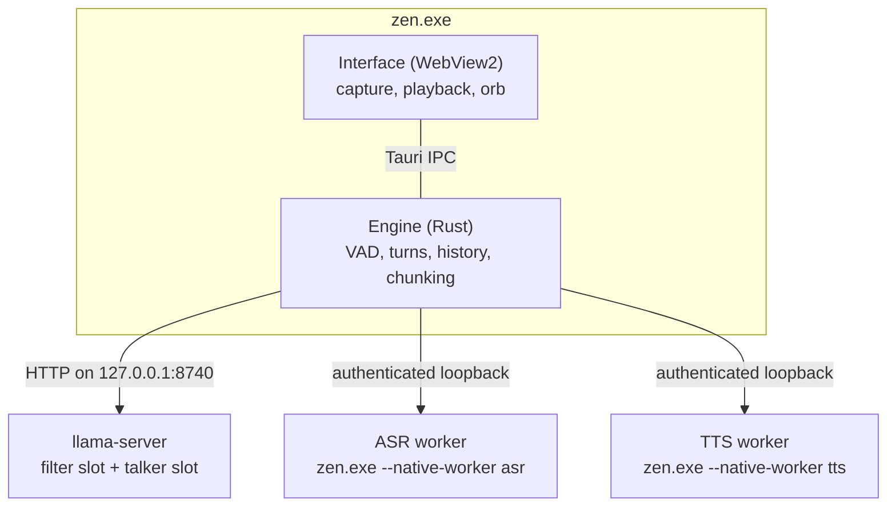

# Architecture

This document explains how Zen is put together and why. For the message-level contract
between the interface and the engine, see [PROTOCOL.md](../PROTOCOL.md). Every Rust module also
opens with a `//!` comment covering its own design.

## One process, two halves

The window's embedded webview (WebView2, which is Chromium) and the Rust engine are the same
process, and they talk over Tauri IPC.

- **The webview owns the audio devices.** Capture and playback live in the page, so Zen gets
  Chromium's echo cancellation, noise suppression and automatic gain control, device
  selection, and a real output clock to acknowledge playback against.
- **The Rust side owns everything else:** voice activity detection, recognition, the language
  model, synthesis, conversation state and the lifetimes of the native processes.

The interface (markup, stylesheet, scripts, the capture and playback worklets and the Inter
and Newsreader fonts) is compiled into `zen.exe` and served from Tauri's private app origin.
The models and native libraries live beside the executable; see [SETUP.md](SETUP.md).



### Native processes

The ASR and TTS libraries each run in their own worker process. That process is `zen.exe`
itself, re-executed as `--native-worker asr|tts`. Their GGML builds differ (CPU for
recognition, CUDA for synthesis), and loading both into one process would let one bind the
other's DLLs. Framed PCM travels over authenticated loopback sockets. Native stdout and stderr
go to the null device. A worker crash, bad PCM or a stalled request fails the current turn,
and the worker is recreated on the next request.

`llama-server` is a supervised child bound to loopback. Every child is assigned to a Windows
job object with `KILL_ON_JOB_CLOSE` (`src/job.rs`). Dropping a handle kills a child on an
orderly exit, but nothing runs when Zen is ended from Task Manager or crashes. Without the job
object a surviving `llama-server` would hold about two gigabytes of graphics memory and port
8740, and on a 4 GB card the next launch could not start.

## The language model: one server, two slots

`src/engine.rs` runs a single `llama-server` with exactly two slots, fixed rather than
scheduled:

| Slot | Role | KV discipline |
| --- | --- | --- |
| 0 | **Filter**: repairs the transcript and translates it into English | Stateless: each request stands alone |
| 1 | **Talker**: writes the spoken reply | Stateful: the system prompt is a stable, cached prefix |

The talker prompt is compiled in and byte-identical on every run, which lets the server reuse
its cached prefix instead of reprocessing it. It is composed from two files: the voice rules
that keep a reply speakable (`src/prompts/core.txt`) followed by the persona
(`src/prompts/talker.txt`). Only the persona is replaceable, so instructions typed into
Settings cannot drop the rules underneath them. Both slots get 8,192 tokens. Every layer is
pinned to the GPU (`--n-gpu-layers 99` with `--fit off`, so auto-fit cannot quietly move
layers back to the CPU), the KV cache is q4_0 with a full sliding window, and a Gemma 4
Multi-Token Prediction drafter proposes up to three tokens ahead. Thinking is disabled at the
server: reasoning tokens would be decode time the listener hears as silence.

Measured on the reference machine, the LLM uses 1.6 GB of VRAM and decodes at 81–97 tokens/s.

## Listening

```text
  microphone ─► Chromium AEC/NS/AGC ─► 70 Hz high-pass ─► AudioWorklet, band-limited to 16 kHz
                                                          20 ms / 320 samples
                                                               │  ordered IPC
                                                               ▼
                     Silero VAD (512-sample frames) ─► segmenter ─► ASR chunks
```

- **Capture** runs an interactive `AudioContext`, a 70 Hz high-pass for rumble, and an
  AudioWorklet (`src/client/capture.mjs`) that converts to 16 kHz and sends 20 ms PCM frames
  continuously, silence included. There is no `MediaRecorder` and no cloud recognition.
- **Band-limited before it is decimated.** Everything above 8 kHz in a 16 kHz stream folds
  back into the band the recogniser hears. The worklet used to average each group of samples
  behind one gentle 7 kHz filter, which at 48 kHz let a 10 kHz tone through at 6 kHz only
  12 dB down. It now runs a Kaiser-windowed sinc low-pass sized from its specification - flat
  to 7 kHz, 60 dB down from 9 kHz - for whatever rate the device runs at: 88 taps and 0.9 ms
  of delay at 48 kHz. Measured, 9-12 kHz tones now come back 64-68 dB down, and the passband
  is flat to 7 kHz where the old filter was already 2 dB down.
- **One ordered path.** IPC calls are independent promises and can arrive out of order: four
  reorderings in three hundred frames were measured, one jumping five places. Five frames is
  enough for an `end_audio` to overtake the words it follows. So capture and control share one
  command, with exactly one call in flight and the rest queued behind it. Under pressure the
  page sheds its oldest *capture* frames, never control frames. Losing 20 ms of speech is
  recoverable; losing an acknowledgement wedges the turn.
- **No second processing chain.** Because the webview already applies echo cancellation,
  noise suppression and gain control, the engine applies none of them. Running the chain twice
  pumps noise and strips the quiet consonants the recogniser needs.
- **Silero VAD** alone decides that someone is speaking, and only confirmed speech interrupts
  a reply. It keeps pre-roll so the first syllable is not lost. The page runs no detector of its
  own: taps, fan noise and residual speaker echo pass an energy heuristic that the speech model
  rejects.
- **Recognition** runs on bounded chunks. A pause of about 400 ms emits a chunk for
  transcription while the turn stays open, so most of the utterance is already recognised when
  the turn ends. `src/input.rs` assembles chunks in capture order and finalises the
  utterance exactly once.
- **Long speech is recognised while it is still being said.** Fluent speech can run for many
  seconds without a 400 ms pause, and was then recognised only once it had stopped: a 14.5 s
  passage waited 11.8 s for recognition after the speaker finished (23 September 2026). A piece
  that reaches 6 s is now handed over at the next breath - a gap over 98 ms, the length Silero's
  own `get_speech_timestamps` splits over-long speech at - and one that reaches 10 s with no
  breath is cut where the voice was quietest, repeating 200 ms across the seam so a word it
  falls in is heard whole; words heard on both sides of such a seam are kept once. Both lengths
  are the recogniser's own chunk sizes.
- **Zen's name is a hotword** for the recogniser, which otherwise writes it "Then" or "Zan".
  The library primes it with a sentence ("The following words may appear in the audio: Zen"),
  and given sound with no words - a hum, a burst of noise - the model sometimes writes that
  sentence back out: on 6 of 32 such clips with the hotword, none without (23 September 2026).
  It is taken back out, and a chunk that held nothing else counts as silence rather than as
  speech that went unheard.
- **A turn may run for a minute** before the cap ends it, and even then it ends at the next
  real gap rather than mid-word, because a sentence cut in half is lost entirely: the speaker
  carries straight on, that continuation opens a new turn, and the half already captured goes
  with the utterance it belonged to. Speech that never pauses at all is stopped at twice the
  cap, which is a television or an open microphone rather than a person.
- **Recognition costs about 630 ms per second of speech** on the reference machine. Pieces
  are recognised while the speaker is still talking, so what is left when they stop is the
  last piece, not the whole question. Speaking while that finishes continues the same question
  instead of starting a new one - nothing has been said back yet, so there is nothing to
  interrupt. If the recogniser falls behind, or a question reaches the three minutes of
  speech one question may hold, the turn ends there and is answered from what was heard,
  rather than failing and losing every word already recognised.

### The end-of-turn pause is measured, not configured

A pause longer than the endpoint ends the turn by definition, so the system can never observe
its own mistake from inside a turn. That is why any fixed number cuts somebody off. What it
*can* observe is the speaker carrying on within a moment of being cut: the silence was a
breath, and their real pause was the endpoint plus however long they took to resume.
`EndpointPolicy` in `src/audio.rs` raises the endpoint clear of that at once, gives back an eighth
of whatever it stands above its floor on each uneventful turn (a half-life of about five turns),
and keeps it within 0.6–2.0 s. There is no hand-set value. Settings shows the current one, and
the page hands the last learned value back to the engine at the start of the next session.

## Turns

`src/session.rs` and `src/turn.rs` own the state machine:

```text
IDLE -> LISTENING -> TRANSCRIBING -> THINKING -> PREPARING -> SPEAKING
            ^              |           |           |           |
            |              +           |           |           |
            |   speech here continues  |           |           |
            |     the same question    |           |           |
            +--------------------------+-----------+-----------+
                  confirmed speech interrupts work that has
                    already produced something to cut off
```

- Every turn is fenced by a permanent cancellation flag and a monotonically increasing
  **generation**. Every asynchronous job keeps the generation issued at capture, and results
  from an older generation are dropped.
- Interruption, failure and timeout cancel pending tasks and flush audio. Preparing (synthesis
  has started) and speaking (audio is audibly playing) are separate states.
- Silence that returns to idle is not reported as a failed turn.
- Bounds are explicit: an utterance is capped at three minutes and 128 capture segments, an
  open utterance with no input for three seconds is cancelled, and playback that stops
  acknowledging audio for fifteen seconds cancels the turn.
- **Quiet** sits beside the machine rather than inside it (the runner in `src/remote.rs`).
  After two minutes idle with nothing queued or playing, the runner sends `quiet` once; the
  page turns the microphone off unless the listener chose to keep it on. Typing, clearing
  history or the page's `active` control, sent when the microphone comes back on, restart the
  timer. It replaced a sleep mode that kept listening and woke on Zen's name: waking depended on
  the recogniser spelling the name right for every voice, and a microphone that is simply off
  is the reliable version of the same thing.
- A transcript with nothing in it - only "hmm", "uh", "um", or a vowel-less noise-word like
  "mmph" - ends the turn in silence: it is someone thinking, or a hum the detector took for a
  voice. Passed on, the filter wrote it down as said and Zen answered it.
- "Sorry, I missed that" is said only when the detector was sure of speech and recognition
  produced no words for any of it. It is spoken and never written to the conversation, even
  after it has played.

## Conversation

`src/conversation.rs` holds one invariant: **the history records what the user heard, never
what the model generated.** When a reply is interrupted, the model may have produced two
hundred words while only forty reached the speaker. Storing all two hundred leaves the model
believing it said things the user never heard, and every later turn builds on that gap. Only
phrases the page confirms as played enter history.

A user turn is recorded as soon as its transcript is accepted, before any reply exists. If
the turn is then abandoned (the speaker cut in and asked something else, or the model failed),
the question stays and is carried into the next one: the next thing said is joined to it as
one user turn. Left as separate turns, restating a question a couple of times would stack
several unanswered questions in the window, and the next reply would be composed against all
of them at once; deleting the unanswered one instead would forget something the person really
said.

The window is trimmed in two places. The conversation estimates its own size as each turn is
recorded, and once it passes the limit it evicts old turns down to half the window rather than
just under the limit: every eviction moves the prompt prefix and costs the server its cached
KV, so what a long conversation pays is how often that happens, not how much is dropped.
Measured with the real system prompt and turns the length of a live session, the window first
fills at turn 64 and then evicts about once every 34 turns, never holding fewer than 56 turns.
Then, before each request, the engine applies the model's real chat template, counts tokens
with its tokenizer, reserves the reply budget plus 256 tokens, and drops the oldest complete
exchanges if the estimate was still too generous. Oversized instructions or an oversized
latest input fail explicitly rather than being silently truncated.

## Between the recogniser and the speaker

`src/reply.rs` does three text-in, text-out jobs, so every rule in it is reachable from a
test.

**Transcript repair.** The filter slot answers `CLEAN: <repaired text>`. Its instruction also
allows `ASK: <request to repeat>` when there are no real words at all, but a transcript without
any never reaches it, so an `ASK` is always a small model calling clear words garbled, and the
raw transcript is answered instead. Its token budget is sized from the transcript it has to
write back out, not fixed: a flat budget would really be a limit on how much anyone may say in
one breath. If the repair is still cut off, the server's `finish_reason` reveals it and the
raw transcript is used instead, because a truncated repair is the speaker's question with its
end missing. A guard also rejects a "correction" that
invents words. It measures length in script-aware units rather than whitespace-separated
words, since a sentence in Chinese, Japanese or Thai is one "word" however long it is.
`--no-filter` skips the layer. Typed messages never go through it: there is no recognition in
typing to repair, and sending them through cost every typed turn 0.29–0.50 s (measured in the
running app, 19 September 2026) for nothing but the chance of "correcting" a word nobody
misheard.

**Speakable text.** Replies are prepared for the ear: no markdown, and numbers, dates and
symbols as words.

**Chunking.** Every phrase boundary is a separate call to a synthesiser that cannot see the
text on either side, so intonation restarts at each one. Chunking therefore has a cost, paid
only where it buys something. This synthesiser streams, with first audio at about 600 ms
whatever it is given, so a short first phrase buys almost nothing: an ordinary reply is spoken
whole. The gate is also on the piece released, not only on the buffer: without that, the first
sentence to finish went out however short it was, and a reply arrived as fragments of eight and
twenty-two words. Longer replies are released in stretches of at most ninety words, which also
bounds what one interruption can cost. Word limits and a UTF-8 byte ceiling cover
unpunctuated and unspaced scripts, and decimal lookahead keeps `3.14` in one phrase.

## Speaking

- `src/voice.rs` runs synthesis on a worker thread that can be cancelled mid-phrase, with a
  bounded job queue so fast generation cannot outrun it. Qwen3-TTS streams 24 kHz PCM in
  roughly 250 ms codec chunks, and cancellation is polled between chunks (5 ms to acknowledge
  in the self-test).
- Reply audio travels to the page as raw bytes, not base64 inside JSON, which would cost a
  third more bandwidth and a copy per block. It shares one ordered channel with the events,
  told apart by a kind byte, so a block can never arrive before the `phrase_start` that
  announces it.
- **Playback belongs to the page** (`src/client/audio.mjs`, `src/client/render.js`). Blocks
  are resampled continuously to the device rate and queued in an AudioWorklet that plays them
  as one stream, so there are no per-block start times to get wrong and a busy main thread
  costs buffer depth rather than audio. Synthesis hands over the start of a reply in growing
  lumps - 80, 160, then 320 ms of audio, and the next about 370 ms later - which a buffer depth
  alone cannot see coming, so the start of each reply is held for a playout delay: the latest
  delivery ran behind in recent replies plus how much that varied, seeded from measurements and
  never more than a second. Past that hold the renderer starts once 100 ms is buffered, and
  each underrun deepens that by 40 ms, up to 320 ms. Running dry mid-phrase fades out and back in
  over 4 ms rather than clicking. Each phrase ends on a 6 ms fade held back from the stream, and
  the pause after it is silence in the stream itself, so late IPC delivery cannot move it.
- **Loudness.** A makeup gain of 2.0 brings the voice to −15.1 LUFS, measured by ITU-R
  BS.1770-4 over 93 s of reply-shaped speech (`examples/loudness.rs`): 1.5 dB above the −16.6
  of the earlier 1.65, which sat at the level spoken-word streaming is normalised to but
  sounded quiet on laptop speakers. It is held under a −1 dBTP ceiling by a look-ahead
  true-peak limiter (4× oversampled), so the loudest sounds are turned down smoothly instead
  of being clipped, including peaks that fall between samples; at this gain that happens to
  7.4 % of the speech by more than 1 dB. Louder playback leaves more of Zen's voice for the
  browser's echo canceller to remove: 2.0 was first taken back after Zen interrupted itself
  (18 September 2026, before the capture chain's anti-aliasing filter), then re-measured at
  full Windows volume with no self-interruption, Silero peaking at 0.15 on the canceller's
  output against the 0.5 it takes to interrupt (19 September). Sound cues share the output,
  so a cue that lands on Zen's voice is played about 8 dB lower.
- **Acknowledgements.** The page acknowledges each block and each completed phrase once the
  renderer has consumed it and the device's output latency has passed on the audio clock,
  Bluetooth latency included. Stopping or suspending output credits nothing unheard, and the
  final phrase completes after the renderer drains without needing more audio. At most about
  two seconds of PCM may await acknowledgement.
- **Interrupted phrases.** A phrase can run for half a minute, so a reply cut off part-way
  keeps the clauses that have certainly been heard (`reply::heard_part`). Where a clause ends
  is estimated from its share of the text, and one counts only once playback is 500 ms past
  that estimate, the latest a clause was measured to end in Zen's voice.

## The window

- Closing the window leaves the engine and conversation resident behind a tray icon, and a
  Windows notification says so the first time. Quit, from the tray or from Settings, hides the
  window at once, gives the session as long as llama-server's own shutdown deadline to close
  cleanly, then ends the process; the job object ends every worker and server with it. The
  native test quits with a session running and checks that nothing Zen started outlives it
  (Zen exited 1.25 s after Quit, 19 September 2026).
- A second launch raises the existing window, since one engine owns the models and the GPU.
- **The reply board** (`src/client/transcript.mjs`) puts Zen's words up a sentence at a time as
  they are said, timed from the playback position rather than from when the text arrived. It
  reads like a prompter: a reply starts at the top, and nothing moves until the words being
  said reach the last line; then the board glides up until they are on the second, with one
  line of what was just said above them. Scrolled up by hand, it is being read, and it stays
  put.
- WebView2 asks the host process before granting a page the microphone. `src/app.rs` answers
  that request. Without a handler the request is never answered and `getUserMedia` hangs
  instead of failing, so the microphone would silently never open.
- The release binary has no console. When Zen cannot start from Explorer it says why in a
  dialog, and engine failures such as a missing model or an occupied port reach the window and
  a Windows notification with the specific reason.
- The window follows the system light or dark appearance (or a remembered choice) and honours
  reduced-motion preferences. The orb (`src/client/orb.mjs`) is a WebGL glass shader that
  deforms with reply-audio energy while Zen speaks and swells more gently with microphone
  energy while it listens, so the turn is readable without a label. An aurora of CSS layers
  around it, and the light it casts on the card, follow the orb's smoothed levels and take the
  state's colour. Everything else that moves - the sky (`src/client/sky.mjs`, three star layers
  drawn once and panned), the aurora, the chip - moves by compositor transforms and opacity;
  nothing is redrawn per frame but the orb. The intro (`src/client/intro.mjs`) is CSS keyframes
  over the page, which then lands by animation delays; its sound, `startup.ogg`, is decoded by
  Web Audio and started at the animation's own current time, so the two stay together however
  long decoding takes. Reduced motion skips both. On the development laptop the window draws
  on the integrated GPU, not the RTX 3050 holding the models: the orb and page kept it about
  41% busy, and the drifting sky added about 10 points (18 September 2026, Zen's default
  window, three interleaved runs each).

## Sessions and privacy

- One window, one session. Ending it revokes the session immediately: the lease stays locked
  through worker teardown, and the ASR, TTS and LLM processes exit before a new session is
  admitted. That discards native speech state and model KV caches as well as the Rust-side
  history.
- Reloading the page detaches it without ending the conversation. Each attachment takes a new
  **revision**, and frames stamped with an older revision are dropped rather than credited to
  the new page.
- **Start new**, in Settings, clears the conversation and adopts new instructions while
  keeping the models loaded.
- Runtime audio, transcripts, replies, native output and per-event diagnostics are not written
  to disk. Native stdout and stderr go to the null device, and disk KV save/restore is
  disabled. The self-test uses synthetic content only.
- The page keeps the last forty displayed messages in memory. Between launches the webview's
  own storage keeps only the settings - the instructions, the theme, the quiet setting - and
  the learned listening pause.

## Verification strategy

Offline tests (`cargo test`, `npm test`, `npm run test:ui`) cover the logic: turn races,
ordering, cancellation, chunk planning, Unicode, budget eviction, revision fencing and session
revocation. Model-dependent tests skip themselves when the model is absent.

Some failures are properties of a model reading a prompt rather than of any code, such as the
filter answering a question instead of transcribing it, or declaring a clear sentence
unintelligible. No offline test can reach those. `zen.exe --self-test` runs the shipped prompts
against the real models, and `tests/native-smoke.cjs` drives the real window over WebView2's
debugging port. Echo rejection, perceived interruption timing and latency under load still need
real conversations on real hardware.
