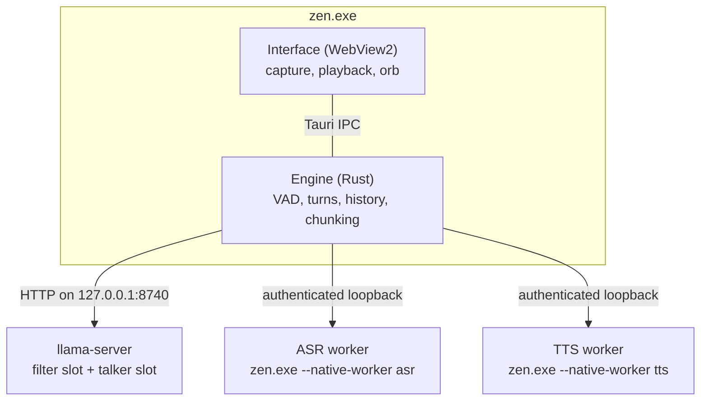

# Architecture

This document explains how Zen is put together and why. For the message-level contract
between the interface and the engine, see [PROTOCOL.md](../PROTOCOL.md). Every Rust module also
opens with a `//!` comment covering its own design.

## One process, two halves

The window's embedded webview (WebView2, which is Chromium) and the Rust engine are the same
process, and they talk over Tauri IPC.

- **The webview owns the audio devices.** Capture and playback live in the page, so Zen gets
  Chromium's echo cancellation, noise suppression and automatic gain control, device
  selection, and a real output clock to acknowledge playback against.
- **The Rust side owns everything else:** voice activity detection, recognition, the language
  model, synthesis, conversation state and the lifetimes of the native processes.

The interface (markup, stylesheet, scripts, the microphone worklet and the Inter font) is
compiled into `zen.exe` and served from Tauri's private app origin. The models and native
libraries live beside the executable; see [SETUP.md](SETUP.md).



### Native processes

The ASR and TTS libraries each run in their own worker process. That process is `zen.exe`
itself, re-executed as `--native-worker asr|tts`. Their GGML builds differ (CPU for
recognition, CUDA for synthesis), and loading both into one process would let one bind the
other's DLLs. Framed PCM travels over authenticated loopback sockets. Native stdout and stderr
go to the null device. A worker crash, bad PCM or a stalled request fails the current turn,
and the worker is recreated on the next request.

`llama-server` is a supervised child bound to loopback. Every child is assigned to a Windows
job object with `KILL_ON_JOB_CLOSE` (`src/job.rs`). Dropping a handle kills a child on an
orderly exit, but nothing runs when Zen is ended from Task Manager or crashes. Without the job
object a surviving `llama-server` would hold about two gigabytes of graphics memory and port
8740, and on a 4 GB card the next launch could not start.

## The language model: one server, two slots

`src/engine.rs` runs a single `llama-server` with exactly two slots, fixed rather than
scheduled:

| Slot | Role | KV discipline |
| --- | --- | --- |
| 0 | **Filter**: repairs the transcript and translates it into English | Stateless: each request stands alone |
| 1 | **Talker**: writes the spoken reply | Stateful: the system prompt is a stable, cached prefix |

The talker prompt (`src/prompts/talker.txt`) is compiled in and byte-identical on every run,
which lets the server reuse its cached prefix instead of reprocessing it. Both slots get 8,192
tokens. Every layer is pinned to the GPU (`--n-gpu-layers 99` with `--fit off`, so auto-fit
cannot quietly move layers back to the CPU), the KV cache is q4_0 with a full sliding window,
and a Gemma 4 Multi-Token Prediction drafter proposes up to three tokens ahead. Thinking is
disabled at the server: reasoning tokens would be decode time the listener hears as silence.

Measured on the reference machine, the LLM uses 1.6 GB of VRAM and decodes at 81–97 tokens/s.

## Listening

```text
  microphone ─► Chromium AEC/NS/AGC ─► speech-band filter ─► AudioWorklet
                                                              20 ms / 320 samples @ 16 kHz
                                                                   │  ordered IPC
                                                                   ▼
                     Silero VAD v6 (576-sample frames) ─► segmenter ─► ASR chunks
```

- **Capture** runs an interactive `AudioContext`, a speech-band input filter, and an
  AudioWorklet (`src/client/capture.js`) that sends 20 ms PCM frames continuously, silence
  included. There is no `MediaRecorder` and no cloud recognition.
- **One ordered path.** IPC calls are independent promises and can arrive out of order: four
  reorderings in three hundred frames were measured, one jumping five places. Five frames is
  enough for an `end_audio` to overtake the words it follows. So capture and control share one
  command, with exactly one call in flight and the rest queued behind it. Under pressure the
  page sheds its oldest *capture* frames, never control frames. Losing 20 ms of speech is
  recoverable; losing an acknowledgement wedges the turn.
- **No second processing chain.** Because the webview already applies echo cancellation,
  noise suppression and gain control, the engine applies none of them. Running the chain twice
  pumps noise and strips the quiet consonants the recogniser needs.
- **Silero VAD** confirms speech before a reply is interrupted, and keeps pre-roll so the
  first syllable is not lost. The worklet's energy hint alone cannot cancel output, because
  taps, fan noise and residual speaker echo can pass an energy heuristic that the speech model
  rejects.
- **Recognition** runs on bounded, overlapping chunks. A pause of about 400 ms emits a chunk
  for transcription while the turn stays open, so most of the utterance is already recognised
  when the turn ends. `src/input.rs` assembles chunks in capture order and finalises the
  utterance exactly once.

### The end-of-turn pause is measured, not configured

A pause longer than the endpoint ends the turn by definition, so the system can never observe
its own mistake from inside a turn. That is why any fixed number cuts somebody off. What it
*can* observe is the speaker carrying on within a moment of being cut: the silence was a
breath, and their real pause was the endpoint plus however long they took to resume.
`EndpointPolicy::Adaptive` in `src/audio.rs` raises the endpoint clear of that at once, relaxes
it by one 36 ms frame per uneventful turn, and keeps it within 0.6–2.0 s. Settings shows the
current value, and **Set myself** fixes it instead.

## Turns

`src/session.rs` and `src/turn.rs` own the state machine:

```text
IDLE -> LISTENING -> TRANSCRIBING -> THINKING -> PREPARING -> SPEAKING
            ^              |           |           |           |
            +--------------+-----------+-----------+-----------+
                 confirmed speech interrupts any active work
```

- Every turn is fenced by a permanent cancellation flag and a monotonically increasing
  **generation**. Every asynchronous job keeps the generation issued at capture, and results
  from an older generation are dropped.
- Interruption, failure and timeout cancel pending tasks and flush audio. Preparing (synthesis
  has started) and speaking (audio is audibly playing) are separate states.
- Silence that returns to idle is not reported as a failed turn.
- Bounds are explicit: an utterance is capped at three minutes and 128 capture segments, an
  open utterance with no input for three seconds is cancelled, and a speaker that stops making
  progress cancels the turn after fifteen seconds.

## Conversation

`src/conversation.rs` holds one invariant: **the history records what the user heard, never
what the model generated.** When a reply is interrupted, the model may have produced two
hundred words while only forty reached the speaker. Storing all two hundred leaves the model
believing it said things the user never heard, and every later turn builds on that gap. Only
phrases the page confirms as played enter history.

A user turn is recorded as soon as its transcript is accepted, before any reply exists. If
the turn is then abandoned (the speaker cut in and asked something else, or the model failed),
the question is removed again. Without that, restating a question a couple of times leaves
several unanswered questions in the window, and the next reply is composed against all of
them at once.

Before each request the engine applies the model's real chat template, counts tokens with its
tokenizer, reserves the reply budget plus 256 tokens, and evicts complete old exchanges until
the request fits. Oversized instructions or an oversized latest input fail explicitly rather
than being silently truncated.

## Between the recogniser and the speaker

`src/reply.rs` does three text-in, text-out jobs, so every rule in it is reachable from a
test.

**Transcript repair.** The filter slot answers `CLEAN: <repaired text>` or, only when there
are no real words at all, `ASK: <request to repeat>`. Its token budget is sized from the
transcript it has to write back out, not fixed: a flat budget would really be a limit on how
much anyone may say in one breath. If the repair is still cut off, the server's
`finish_reason` reveals it and the raw transcript is used instead, because a truncated repair
is the speaker's question with its end missing. A guard also rejects a "correction" that
invents words. It measures length in script-aware units rather than whitespace-separated
words, since a sentence in Chinese, Japanese or Thai is one "word" however long it is.
`--no-filter` skips the layer.

**Speakable text.** Replies are prepared for the ear: no markdown, and numbers, dates and
symbols as words.

**Chunking.** Every phrase boundary is a separate call to a synthesiser that cannot see the
text on either side, so intonation restarts at each one. Chunking therefore has a cost, paid
only where it buys something. This synthesiser streams, with first audio at about 620 ms
whatever it is given, so a short first phrase buys almost nothing: a reply of one or two
sentences is spoken whole. Longer replies are released in stretches of at most sixty words,
which also bounds what one interruption can cost. Word limits and a UTF-8 byte ceiling cover
unpunctuated and unspaced scripts, and decimal lookahead keeps `3.14` in one phrase.

## Speaking

- `src/voice.rs` runs synthesis on a worker thread that can be cancelled mid-phrase, with a
  bounded job queue so fast generation cannot outrun it. Qwen3-TTS streams 24 kHz PCM in
  roughly 250 ms codec chunks, and cancellation is polled between chunks (4 ms to acknowledge
  in the self-test).
- Reply audio travels to the page as raw bytes on its own channel, not base64 inside JSON,
  which would cost a third more bandwidth and a copy per block.
- **Playback scheduling belongs to the page** (`src/client/audio.mjs`). An adaptive 100–160 ms
  jitter buffer covers startup and real underruns. A chunk that arrives before the previous one
  finishes stays contiguous, and phrase pauses are timed from the audio's end, so delayed IPC
  delivery cannot restart an elapsed pause. A 6 ms equal-power fade smooths codec block seams
  without inserting silence.
- **Loudness.** Makeup gain is held under the ceiling by a limiter that follows the envelope
  instead of bending each sample. A static curve left about 3% of the output as something other
  than a scaled copy of the input at the synthesiser's measured peak, and 18% on a held note,
  heard as roughness on the loudest, most sustained sounds. Following the envelope brings both
  under 1.5%.
- **Acknowledgements.** The page acknowledges each played block and each completed phrase
  against the device output timestamp, Bluetooth latency included. Stopping or suspending
  output cannot credit unheard text. Past a quarter second the device clock alone is enough, so
  a main thread busy enough to delay one `onended` callback cannot stall the ledger and starve
  playback. At most about two seconds of PCM may await acknowledgement.

## The window

- Closing the window leaves the engine and conversation resident behind a tray icon, and a
  Windows notification says so the first time. Quitting from the tray ends the session.
- A second launch raises the existing window, since one engine owns the models and the GPU.
- WebView2 asks the host process before granting a page the microphone. `src/app.rs` answers
  that request. Without a handler the request is never answered and `getUserMedia` hangs
  instead of failing, so the microphone would silently never open.
- The release binary has no console. When Zen cannot start from Explorer it says why in a
  dialog, and engine failures such as a missing model or an occupied port reach the window and
  a Windows notification with the specific reason.
- The window follows the system light or dark appearance (or a remembered choice) and honours
  reduced-motion preferences. The orb (`src/client/orb.mjs`) is a WebGL glass shader that
  deforms with reply-audio energy while Zen speaks and swells more gently with microphone
  energy while it listens, so the turn is readable without a label.

## Sessions and privacy

- One window, one session. Ending it revokes the session immediately: the lease stays locked
  through worker teardown, and the ASR, TTS and LLM processes exit before a new session is
  admitted. That discards native speech state and model KV caches as well as the Rust-side
  history.
- Reloading the page detaches it without ending the conversation. Each attachment takes a new
  **revision**, and frames stamped with an older revision are dropped rather than credited to
  the new page.
- **Clear history & start fresh** adopts new instructions while keeping the models loaded.
- Runtime audio, transcripts, prompts, native output and per-event diagnostics are not written
  to disk. Native stdout and stderr go to the null device, and disk KV save/restore is
  disabled. The self-test uses synthetic content only.
- The page keeps the last forty displayed messages in memory. The theme and listening pause are
  the only values kept between launches, in the webview's own storage.

## Verification strategy

Offline tests (`cargo test`, `npm test`, `npm run test:ui`) cover the logic: turn races,
ordering, cancellation, chunk planning, Unicode, budget eviction, revision fencing and session
revocation. Model-dependent tests skip themselves when the model is absent.

Some failures are properties of a model reading a prompt rather than of any code, such as the
filter answering a question instead of transcribing it, or declaring a clear sentence
unintelligible. No offline test can reach those. `zen.exe --self-test` runs the shipped prompts
against the real models, and `tests/native-smoke.cjs` drives the real window over WebView2's
debugging port. Echo rejection, perceived interruption timing and latency under load still need
real conversations on real hardware.
